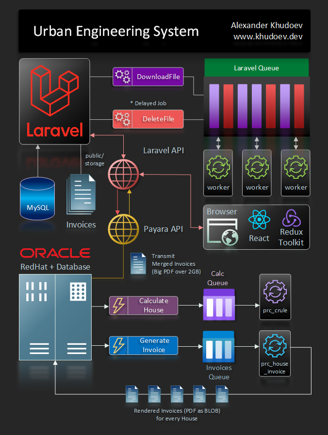

# Table of contents

```toc
exclude: Table of Contents
from-heading: 2
to-heading: 6
```

## Intro

Housing stock management is not an easy task for managing companies in the housing
and communal services sector.
Therefore, we (me and colleagues from Fusionsoft) developed the **Urban Engineering System** that allows you to calculate services, generate reports, print invoices and more.

Tech-stack: Oracle 11g, Laravel 8, React + Redux Toolkit

[](https://www.oracle.com/)
[](https://reactjs.org)
[](https://laravel.com)
[](https://redux-toolkit.js.org/)
[](https://swagger.io/)

The system is so large that I can't place all of its mechanisms,
but only tell about a small part.
In addition, most of the algorithms in the system are confidential, so I will cover the basics.

On this project, me (Alexander Khudoev) acted as a Full Stack developer since 2015, and performed the following dev tasks:

- Oracle database - refinement of the existing architecture, queries optimization, new tables, reports and functionality development.
- Backend API on Laravel 8 - development and architect (since 2021).
- Swagger documentation for the OpenAPI v3 (OAS v3) standard - development and architect.
- Frontend with React + Redux-Toolkit using Tailwind CSS and Material-UI - development and design.

## 1. System Structure

### 1.1. Logical Diagram

Since the system's native GUI was quite old (used since 2012)
and there are many problems with `Payara API` and `Oracle Server`,
it was decided to develop a `separate api-layer` for the backend - on `Laravel`,
which will interact with Payara API, and the frontend on `React + Redux Toolkit`.



The initial data source is Oracle DB: all system data is stored here.

Using Fusion-API (Payara API), Oracle data is traced using Payara, and then my Laravel-API layer is connected to Payara API:
to ensure maximum performance, non-blocking calls and send data to the browser for front-end rendering on the React and Redux Toolkit.

### 1.2. Models

The **Urban Engineering System** consists of several Models:

1. Management Companies (Mcomps)
2. Residential Buildings (Houses)
3. Personal Accounts (Personal_Accounts)
4. Payments
5. Invoices
6. Queues (calculating Houses and rendering Invoices)

Since the system is very large and consists of many subsystems, only a small part of the Billing subsystem is presented here. Therefore, the structure of this small part of the Oracle Database can be represented in an easy-to-understand style in the form of an ER diagram:


#### 1.2.1. Management companies <a name="management-companies"></a>

The **Management Company** is the main element of the system. For each of them, you can set various details of the company, such as: legal address, phone number, name of the director, accountant, and others. As well as the type of billing period, which is responsible for the procedure for accruals and payments.
For example, there may be several options for the **Accrual Period Type**:

- Payment, then Accrual
- Accrual, then Payment
- Accrual in the next period, Payment in the current period

The Management Company contains: "Residential Fund" or **"Residential Buildings"**, which are then available for viewing in the context of the Management Company.

On a separate **"House management"** tab, you can add a New House to the Management Company, assign parameters, and temporarily exclude existing house from the calculation, or even delete it altogether.

#### 1.2.2. Residential Buildings

The Residential buildings (houses) table consists of many fields, but only a few are visible to the user:

- **Address**
- **Stories** - number of floors
- **Residents** - number of residents
- **Company** - a management company that services the house
- **Balance** - household balance
- **Calc date** - house calculation date
- **Status** - can take three values: ok, calculating, invoices generation

To find some record in the **Residential buildings** table, it's enough to enter a text part of the string in the **Search** field: it can be text part of the address of the house, Company name, Date, Status.

_Attention! All information presented in the screenshots of the Urban Engineering System reflects fictitious demo data._


#### 1.2.3. Personal Accounts

The table of personal accounts is available both inside the house in the form of a separate horizontal tab
with filtering by the current house (see the figure below),
and a separate vertical tab with global filtering by the Management Company.

After clicking on the Personal account, a dialog opens with additional information displayed and the ability to edit
the fields of the personal account (if this user has editing rights).


#### 1.2.4. Payments

Payments are loaded into the system from external DBF and CSV files provided
by a third-party Payment Provider - this can be a Bank or a Payment System.

The received file is parsed using separate PL/SQL methods from the package
and payments are distributed among Personal Accounts.

I can't tell you more because its confidential information.

#### 1.2.5. Invoices

Invoices are formed according to a template that is developed in xls format and then rendered in xls or pdf
using a special report engine.

The file is written as a BLOB data type to the corresponding field of the database table.

#### 1.2.6. Queues

There are 2 types of queues in the Urban Engineering System:

- to calculate accruals on personal accounts and further on the house, and then on the Management Company
- to generate invoices for personal accounts

After the user presses the button on a House for Calculation,
the House enters the House Calculation Queue.
Further, a separate Oracle Job, which is launched after a certain time interval, reads the queue table
and starts the procedures for calculating personal accounts within this House.

Then, when the calculation of the House is completed, it enters the Queue for the generation of Invoices.
At the same time, another Job is launched - to generate an invoice.

After all invoices have been generated, they are combined into one large PDF file,
which is attached to the Management Company for the specified Period.

There is 2 queues in Oracle DBMS that controlled by two scheduled jobs:

- `prc_crule` - for calculate the houses from `house_crule_events` queue table


- `prc_house_invoice` - for generate the invoices from the `house_invoice_events` queue table


## 2. Laravel non-blocking API and Queues

For the interaction between the Oracle database and Payara + Tomcat,
it was decided to use Laravel as an additional layer for API.

It is worth noting that there are many ways to make PHP code non-blocking. But in this project,
I implemented it using Laravel Queues.

Initially, the problem was that API blocking occurred when the user started downloading
a large file from the server, or launched some long-term Oracle procedure to execute.
At the same time, the API was blocked not only at the level of the current user,
but also at the level of other users for whom separate authorization sessions were created.
If you send any parallel request to the API, then it did not respond.
The API feedback came only after the completion of the long-term process.

### 2.1. Create the separate StorageFiles on the Laravel Server

All files will be downloaded from Oracle server to the separate Laravel Storage.

#### 2.1.1. Storage Files table

Let's create the database table to store our files attributes:

```shell
php artisan make:migration create_storage_files_table --create=storage_files
```

We need to create some fields for the file attributes inside this migration:

```php:title=create_storage_file_table.php
<?php

use Illuminate\Database\Migrations\Migration;
use Illuminate\Database\Schema\Blueprint;
use Illuminate\Support\Facades\Schema;

class CreateStorageFilesTable extends Migration
{
    /**
     * Run the migrations.
     *
     * @return void
     */
    public function up()
    {
        Schema::create('storage_files', function (Blueprint $table) {
            $table->bigIncrements('id');
            $table->string('user_name');
            $table->string('file_status')->nullable();
            $table->string('download_progress')->nullable();
            $table->string('storage_file_name')->nullable();
            $table->string('file_name')->nullable();
            $table->string('file_type');
            $table->string('file_size')->nullable();
            $table->string('file_size_src')->nullable();
            $table->text('fusion_url')->nullable();
            $table->text('download_link')->nullable();
            $table->text('duration')->nullable();
            $table->timestamps();
        });
    }

    /**
     * Reverse the migrations.
     *
     * @return void
     */
    public function down()
    {
        Schema::dropIfExists('storage_files');
    }
}
```

#### 2.1.2. Storage Files - Model

Let's create the Model and Controller for Storage_Files:

```shell
php artisan make:model StorageFiles -c
```

Now, we need to modify our `StorageFiles.php` to correct the `date` field:

```php:title=StorageFiles.php
<?php

namespace App;

use DateTimeInterface;
use Illuminate\Database\Eloquent\Model;
use Illuminate\Support\Facades\Storage;

class StorageFiles extends Model
{
    protected $guarded = array();

    /*
     * Before Laravel 7, dates would be serialized to a format like the following :

    2019-12-02 20:01:00
    Dates serialized using the ISO-8601 format will appear like :

    2019-12-02T20:01:00.283041Z
    Please note that ISO-8601 dates are always expressed in UTC.

    If you would like to keep using the previous behavior you can override
    the serializeDate() method on your model :
     * */

    protected function serializeDate(DateTimeInterface $date)
    {
        return $date->format('d.m.Y H:i:s');
    }

    public function getDownloadProgressAttribute()
    {
        return Storage::exists($this->storage_file_name)
            ? Storage::size($this->storage_file_name)
            : $this->attributes['download_progress'];
    }
}
```

#### 2.1.3. Storage Files - Controller

And here is `StorageFilesController.php` adapted to Swagger OpenAPI v3 (php-swagger) documentation:

```php:title=StorageFilesController.php
<?php

namespace App\Http\Controllers;

use App\Jobs\DownloadFusionFile;
use App\Services\Fusion;
use App\StorageFiles;
use Illuminate\Http\Request;
use Illuminate\Support\Facades\Storage;

class StorageFilesController extends Controller
{
    /**
     * @OA\Get(
     *     path="/storage_files",
     *     tags={"Storage Files"},
     *     summary="Storage files list by username",
     *     operationId="indexStorageFiles",
     *     security={{"cookieAuth": {}}},
     *     @OA\Parameter(
     *     name="username",
     *     in="query",
     *     required=false,
     *     example="Ronald",
     *     ),
     *     @OA\Response(
     *         response=200,
     *         description="Success",
     *         @OA\JsonContent(ref="#/components/schemas/StorageFileResponse"),
     *     )
     * )
     */
    public function index(Request $request)
    {
        //get request params
        $username = $request->get('username');
        if ($username !== null) {
            $items = StorageFiles::
                        where('user_name', $username)
                        ->where('file_status', '<>', 'deleted')
                        ->get();
        }
        else
        {
            $items = StorageFiles::where('file_status', '<>', 'deleted')->get();
        }

        return response()->json($items, 200);
    }

    /**
     * @OA\Get(
     *     path="/storage_files/count",
     *     tags={"Storage Files"},
     *     summary="Storage files count statuses by username",
     *     operationId="storageFilesCount",
     *     security={{"cookieAuth": {}}},
     *     @OA\Parameter(
     *     name="username",
     *     in="query",
     *     required=false,
     *     example="vasya",
     *     ),
     *     @OA\Response(
     *         response=200,
     *         description="Success",
     *         @OA\JsonContent(ref="#/components/schemas/StorageFileResponse"),
     *     )
     * )
     */
    public function items_count(Request $request)
    {
        //get request params
        $username = $request->get('username');
        if ($username !== null) {
            $d_count = StorageFiles::
                where('user_name', $username)
                ->where('file_status', 'downloading')
                ->get()->count();

            $r_count = StorageFiles::
                where('user_name', $username)
                ->where('file_status', 'ready')
                ->get()->count();

            $a_count = StorageFiles::
                where('user_name', $username)
                ->where('file_status', '<>', 'deleted')
                ->get()->count();
        }
        else
        {
            $d_count = StorageFiles::where('file_status', 'downloading')->get()->count();
            $r_count = StorageFiles::where('file_status', 'ready')->get()->count();
            $a_count = StorageFiles::where('file_status', '<>', 'deleted')->get()->count();
        }

        $res = array(
            "d_count" => $d_count,
            "r_count" => $r_count,
            "a_count" => $a_count
        );
        return response()->json($res, 200);
    }

    /**
     * @OA\Get(
     *     path="/storage_files/addFileToQueue",
     *     tags={"Storage Files"},
     *     summary="add file to download queue by file_url",
     *     operationId="addFileToQueue",
     *     security={{"cookieAuth": {}}},
     *     description="Add file to the download queue",
     *     @OA\Parameter(
     *     name="file_url",
     *     in="query",
     *     required=true,
     *     example="http://xxx.xxx.xxx.xxx/yyyyy/download?datasource=TYPENAME&field=FILEDNAME&oid=...&typeOID...&filename=...",
     *     ),
     *     @OA\Parameter(
     *     name="file_type",
     *     in="query",
     *     required=true,
     *     example="RAR Invoice",
     *     ),
     *     @OA\Parameter(
     *     name="file_extension",
     *     in="query",
     *     required=true,
     *     example="rar",
     *     ),
     *     @OA\Parameter(
     *     name="file_size_src",
     *     in="query",
     *     required=false,
     *     example="5678943",
     *     ),
     *     @OA\Response(
     *         response=200,
     *         description="Success",
     *         @OA\JsonContent(ref="#/components/schemas/InvoiceBinaryPDFFileResponse"),
     *     )
     * )
     */

    public function addFileToQueue(Request $request, Fusion $api)
    {
        //get request params
        $file_url = $request->get('file_url');
        $file_type = $request->get('file_type');
        $file_extension = $request->get('file_extension');
        $file_size_src = $request->get('file_size_src');
        $cookies = $request->get('cookies');

        if (empty($file_size_src)) {
            $file_size_src = '';
        }

        if (!empty($cookies)) {
            $api->setCookies($cookies);
        }

        $sf = StorageFiles::
            where('fusion_url', $file_url)->
            where('user_name', $api->cookieAr['currentUser'])->
            first();

        if ($sf === null) {
            DownloadFusionFile::dispatch($file_url, $api->cookieAr, $file_type, $file_extension, $file_size_src);
            return response()->json(array('success' => 'y'), 200);
        } else {
            $err = array(
                "code" => 'file_already_exist',
                "name" => 'Файл уже скачивается или был скачан'
            );

            return response()->json($err, 400);
        }
    }

    /**
     * @OA\Get(
     *     path="/storage_files/download",
     *     tags={"Storage Files"},
     *     summary="download Storage File by name",
     *     operationId="downloadStorageFile",
     *     security={{"cookieAuth": {}}},
     *     @OA\Parameter(
     *     name="filename",
     *     in="query",
     *     required=true,
     *     example="file_12345.rar",
     *     ),
     *     @OA\Parameter(
     *     name="deleteAfterDownload",
     *     in="query",
     *     required=true,
     *     example="true",
     *     ),
     *     @OA\Response(
     *         response=200,
     *         description="Success",
     *         @OA\JsonContent(ref="#/components/schemas/StorageFileResponse"),
     *     )
     * )
     */
    public function download(Request $request)
    {

        //get request params
        $filename = $request->get('filename');
        $deleteAfterDownload = $request->get('deleteAfterDownload');

        if ($filename !==null) {
            $sf = StorageFiles::where('storage_file_name', $filename)->first();
            if ($sf !== null && Storage::exists($filename)) {
                switch ($deleteAfterDownload) {
                    case 'true':
                        $sf->file_status = 'deleted';
                        $sf->update();
                        return response()->download($sf->download_link, $sf->file_name)->deleteFileAfterSend(true);
                    case 'false':
                        return Storage::download($filename, $sf->file_name);
                }
            }
            else
            {
                $err = array(
                    "code" => 'file ' . $filename . ' doesnt exist',
                    "name" => 'File doesnt exist'
                );

                return response()->json($err, 400);
            }
        }
        else
        {
            $err = array(
                "code" => 'filename is empty',
                "name" => 'File name not specified'
            );

            return response()->json($err, 400);
        }
    }

    /**
     * @OA\Delete(
     *     path="/storage_files/delete",
     *     tags={"Storage Files"},
     *     summary="Delete storage file",
     *     operationId="deleteStorageFile",
     *     security={{"cookieAuth": {}}},
     *     @OA\RequestBody(
     *         required=true,
     *         description="Input data format",
     *         @OA\JsonContent(ref="#/components/schemas/StorageFileDeleteRequest")
     *
     *     ),
     *     @OA\Response(
     *         response=200,
     *         description="Success"
     *     )
     * )
     */

    public function delete(Request $request, Fusion $api) {

        $filename = $request->get('storage_file_name');
        $username = $api->cookieAr['currentUser'];
        $sf = StorageFiles::
            where('user_name', $username)->
            where('storage_file_name', $filename)
            ->first();

        if($sf !== null && Storage::exists($filename)) {
            Storage::delete($filename);
        }

        if ($sf !== null) {
            $sf->delete();
        }

        return response()->json(array('success' => 'y'));
    }

}
```

Then we need to re-generate the l5-swagger documents (or they will be generated automatically
after reloading the swagger documentation page if this option was set in the l5-swagger config).


#### 2.1.4. API-Routes for Storage Files

```php:title=routes/api.php
// StorageFiles
Route::get('storage_files', 'StorageFilesController@index')->middleware('check_cookie');
Route::get('storage_files/addFileToQueue', 'StorageFilesController@addFileToQueue')->middleware('check_cookie');
Route::get('storage_files/download', 'StorageFilesController@download')->middleware('check_cookie');
Route::get('storage_files/count', 'StorageFilesController@items_count')->middleware('check_cookie');
Route::delete('storage_files/delete', 'StorageFilesController@delete')->middleware('check_cookie');
```

For security reasons, I can't give you the Middleware code.

Also, we need to disable the `delete-method` inside `VerifyCsrfToken` Middleware:

```php:title=VerifyCsrfToken.php
<?php

namespace App\Http\Middleware;

use Illuminate\Foundation\Http\Middleware\VerifyCsrfToken as Middleware;

class VerifyCsrfToken extends Middleware
{
    /**
     * The URIs that should be excluded from CSRF verification.
     *
     * @var array
     */
    protected $except = [
        '/api/login',
    // Storage Files
        'api/storage_files/delete',
    // RunningFusionFuncs
        'api/fq/delete/',
        'api/fq/delete_completed/',
    // House Management
        'api/hm/edit',
    // ..other routes
    ];
}
```

#### 2.1.5. Setting the File System Options in Laravel

The filesystem config looks like this:

```php:title=config/filesystem.php
<?php

return [

    /*
    |--------------------------------------------------------------------------
    | Default Filesystem Disk
    |--------------------------------------------------------------------------
    |
    | Here you may specify the default filesystem disk that should be used
    | by the framework. The "local" disk, as well as a variety of cloud
    | based disks are available to your application. Just store away!
    |
    */

    'default' => env('FILESYSTEM_DRIVER', 'public'),

    /*
    |--------------------------------------------------------------------------
    | Default Cloud Filesystem Disk
    |--------------------------------------------------------------------------
    |
    | Many applications store files both locally and in the cloud. For this
    | reason, you may specify a default "cloud" driver here. This driver
    | will be bound as the Cloud disk implementation in the container.
    |
    */

    'cloud' => env('FILESYSTEM_CLOUD', 's3'),

    /*
    |--------------------------------------------------------------------------
    | Filesystem Disks
    |--------------------------------------------------------------------------
    |
    | Here you may configure as many filesystem "disks" as you wish, and you
    | may even configure multiple disks of the same driver. Defaults have
    | been setup for each driver as an example of the required options.
    |
    | Supported Drivers: "local", "ftp", "sftp", "s3"
    |
    */

    'disks' => [

        'local' => [
            'driver' => 'local',
            'root' => storage_path('app'),
        ],

        'public' => [
            'driver' => 'local',
            'root' => storage_path('app/public'),
            'url' => env('APP_URL').'/storage',
            'visibility' => 'public',
        ],

        's3' => [
            'driver' => 's3',
            'key' => env('AWS_ACCESS_KEY_ID'),
            'secret' => env('AWS_SECRET_ACCESS_KEY'),
            'region' => env('AWS_DEFAULT_REGION'),
            'bucket' => env('AWS_BUCKET'),
            'url' => env('AWS_URL'),
            'endpoint' => env('AWS_ENDPOINT'),
        ],

    ],

    /*
    |--------------------------------------------------------------------------
    | Symbolic Links
   ----------------------------------------------------
    |
    | Here you may configure the symbolic links that will be created when the
    | `storage:link` Artisan command is executed. The array keys should be
    | the locations of the links and the values should be their targets.
    |
    */

    'links' => [
        public_path('storage') => storage_path('app/public'),
    ],

];
```

And now we need to link our `Storage` to the public path folder on the Laravel Server:

```shell
php artisan storage:link
```

### 2.2. Moving the file download procedure to a separate Laravel Queue

Now my task was to download a large (over 2GB) PDF file from the Oracle Database server,
so that parallel requests to the API wouldn't be blocked.

To download a file from the Oracle server,
I could use Laravel's built-in HTTP client (minimal API around the Guzzle HTTP client).
But for more flexibility,
I decided to use the [Guzzle](https://github.com/guzzle/guzzle) http-client directly.

#### 2.2.1. DownloadFile Job

My task now is to download a file from the Oracle database via Payara-api to a temporary
File Storage located on the Laravel server. At the same time,
I will start downloading the file in a separate process using Laravel Queues and Jobs,
which will be processed by Workers.

To create the Job Class in Laravel we need to run this command in terminal:

```shell
php artisan make:job DownloadFile
```

Inside the `DownloadFile` Job class, we must pass all the necessary fields,
including cookie authorization parameters (which come from JWT) - so that an authorized user
can download a file,
and also see a list of his files in the queue (without interfering with other users).

```php:title=DownloadFile.php
<?php

namespace App\Jobs;

use App\StorageFiles;
use GuzzleHttp\Client;
use GuzzleHttp\Cookie\CookieJar;
use Illuminate\Bus\Queueable;
use Illuminate\Contracts\Queue\ShouldQueue;
use Illuminate\Foundation\Bus\Dispatchable;
use Illuminate\Queue\InteractsWithQueue;
use Illuminate\Queue\SerializesModels;
use Illuminate\Support\Carbon;
use Illuminate\Support\Facades\Log;
use Illuminate\Support\Facades\Storage;

class DownloadFusionFile implements ShouldQueue
{
    use Dispatchable, InteractsWithQueue, Queueable, SerializesModels;

    /**
     * @var string
     */
    protected $url;

    /**
     * @var array
     */
    protected $cookiesJar;

    /**
     * @var string
     */
    protected $fileType;

    /**
     * @var string
     */
    protected $fileExtension;

    /**
     * @var string
     */
    protected $fileSizeSrc;


    /**
     * Create a new job instance.
     *
     * @return void
     */
    public function __construct($url,
                                $cookiesJar,
                                $fileType,
                                $fileExtension,
                                $fileSizeSrc)
    {
        $this->url = $url;
        $this->cookiesJar = $cookiesJar;
        $this->fileType = $fileType;
        $this->fileExtension = $fileExtension;
        $this->fileSizeSrc = $fileSizeSrc;
    }

    /**
     * Execute the job.
     *
     * @return void
     */
    public function handle()
    {
        $file_ext = $this->fileExtension;
        $storage_filename = "file_"
            . $this->cookiesJar['currentUser'] . '_'
            . Carbon::now()->format('YmdHs') . '.'
            . $file_ext;
        $file_path = public_path() . "/storage/" . $storage_filename;
        $fileSizeSrc = $this->fileSizeSrc;

        // create a db-record
        // about the file is going to be downloaded
        $sf = new StorageFiles;
        $sf->user_name = $this->cookiesJar['currentUser'];
        $sf->file_status = 'downloading';
        $sf->file_type = $this->fileType;
        $sf->storage_file_name = $storage_filename;
        $sf->fusion_url = $this->url;
        $sf->file_size_src = $fileSizeSrc;
        $sf->save();

        $contentType = 'application/octet-stream';
        switch ($file_ext) {
            case 'rar':
                $contentType = 'application/x-rar-compressed';
                break;
            case 'pdf':
                $contentType = 'application/pdf';
                break;
            case 'xls':
                $contentType = 'application/vnd.ms-excel';
                break;
            case 'csv':
                $contentType = 'text/csv';
                break;
            case 'txt':
                $contentType = 'text/plain';
                break;
            case 'dbf':
                $contentType = 'application/dbase';
                break;
        }
        $headers = [
            'Content-Type' => $contentType,
            'Content-Disposition' => 'attachment; filename="' . $storage_filename . '"'
        ];
        $domain = config('app.FUSION_DOMAIN');
        $cookieJar = CookieJar::fromArray($this->cookiesJar, $domain);
        $client = new Client([
            'headers' => $headers,
            'cookies' => $cookieJar
        ]);

        $response = $client->request(
            'GET', $this->url, [
                'sink' => $file_path
                ]
        );

        $file_name = $response->getHeaderLine('Content-disposition');
        if (preg_match('/.*filename=[\'\"]?([^\"]+)/', $file_name, $matches)) {
            $file_name = urldecode($matches[1]);
        }

        Log::info('File Name = ' . $file_name);

        $sf->file_status = 'ready';
        $sf->file_name = $file_name;
        $sf->file_type = $this->fileType;

        if (isset($response->getHeaders()["Content-Length"])) {
            $sf->file_size = $response->getHeader('Content-Length')[0];
        } else {
            $sf->file_size = Storage::size($sf->storage_file_name);
        }

        $sf->download_link = $file_path;
        $sf->update();

        $sf->duration = $sf->created_at->diff($sf->updated_at)->format('%H:%I:%S');
        $sf->update();

        // queue the deletion of the file and the database record after a while
        $del_after = config('app.DEL_STRG_FILE_AFTER');
        DeleteStorageFile::dispatch($storage_filename)
          ->delay(now()->addMinutes($del_after));
    }
}
```

#### 2.2.2. DeleteStorageFile Job

```php:title=DeleteStorageFile.php
<?php

namespace App\Jobs;

use App\StorageFiles;
use Illuminate\Bus\Queueable;
use Illuminate\Contracts\Queue\ShouldQueue;
use Illuminate\Foundation\Bus\Dispatchable;
use Illuminate\Queue\InteractsWithQueue;
use Illuminate\Queue\SerializesModels;
use Illuminate\Support\Facades\Log;
use Illuminate\Support\Facades\Storage;

class DeleteStorageFile implements ShouldQueue
{
    use Dispatchable, InteractsWithQueue, Queueable, SerializesModels;

    /**
     * @var string
     */
    protected $filename;

    /**
     * Create a new job instance.
     *
     * @return void
     */
    public function __construct($filename)
    {
        $this->filename = $filename;
    }

    /**
     * Execute the job.
     *
     * @return void
     */
    public function handle()
    {
        $downloadLink = public_path(). "/storage/" . $this->filename;
        if (Storage::exists($this->filename)) {
            Storage::delete($this->filename);
            Log::info('file deleted = ' . $downloadLink);
        }

        $deleteRows = StorageFiles::where('download_link', $downloadLink)->delete();
        Log::info('deleteRows = ' . $deleteRows);
    }
}
```

And the last step - run the queue which will be processed by one worker (for example)

```shell
php artisan queue:work
```

## 3. Gitlab deployment Laravel script

The Gitlab uses the Kubernetes container docker orchestrator.
I don’t show some mechanisms here, only the main scripts for deploying and setting up Services
to start Laravel itself and start Queue Workers through the supervisor.

For simplicity and better control, I didn't use Laravel's built-in Envoy.

`deploy.sh`

```shell:title=deploy.sh
composer install --optimize-autoloader --no-dev  --no-interaction --prefer-dist
php artisan clear-compiled --env=production
php artisan optimize --env=production
php artisan migrate --force
php artisan storage:link
sudo systemctl enable billing-backend.service
sudo systemctl stop billing-backend.service
sudo systemctl start billing-backend.service
sudo supervisorctl stop all
sudo supervisorctl restart laravel-worker:*
```

`billing-service.service`

```shell:title=lib/systemd/system/billing-service.service
[Unit]
Description=Billing backend

[Service]
User=www-data
Group=www-data
Restart=on-failure
ExecStart=/usr/bin/php /home/dev/backend/artisan serve --host=0.0.0.0

[Install]
WantedBy=multi-user.target
```

`laravel-worker`

```shell:title=etc/supervisor/conf.d/laravel-worker.conf
[program:laravel-worker]
process_name=%(program_name)s_%(process_num)02d
command=/usr/bin/php /home/dev/backend/artisan queue:work database --sleep=3 --tries=3 --timeout=0
autostart=true
autorestart=true
user=root
numprocs=8
redirect_stderr=true
stdout_logfile=/home/dev/backend/storage/logs/worker.log
stopwaitsecs=3600
```

## Conclusion

_The mechanisms shown in this article are effectively used on the current `Urban Engineering System`
by the administrators of the Management Companies for calculating services on Personal Accounts._

In this article, I showed a way to develop a non-blocking API in Laravel based on Laravel queues.
This method will be relevant for any other frameworks - for example,
to implement this algorithm on Node.js - you need to develop the Queue system in the same way.
In the case of a multilayer API on top of Payara and Oracle, this is much easier to do on Laravel.

© Alexander Khudoev. 2022
